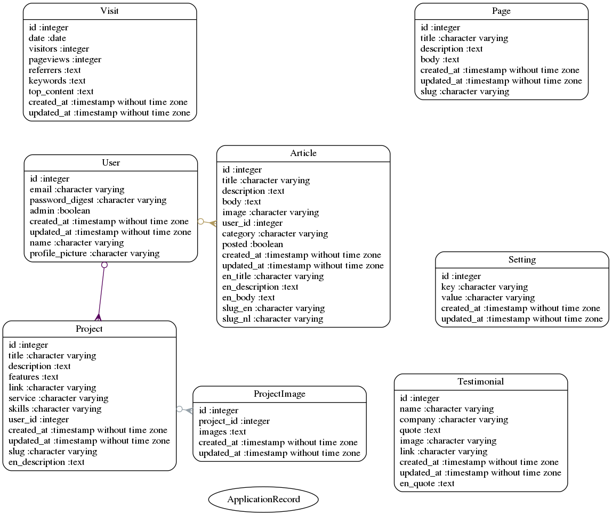
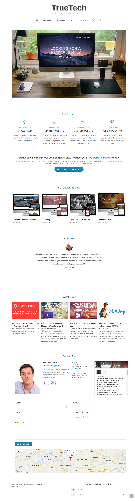
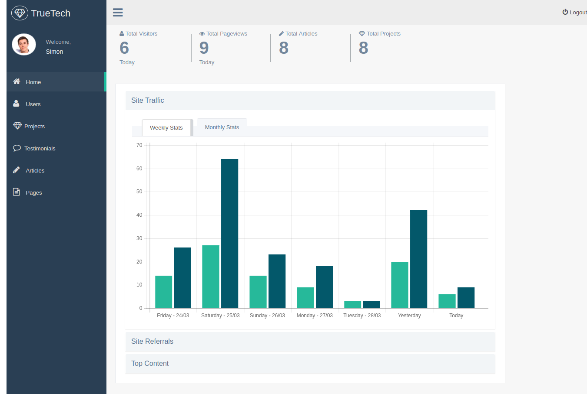

# Simon Somlai

> Last version of my company website.

# Tech Stack

- <b>Front:</b> HTML, CSS, JS
- <b>JS Libraries:</b> lightgallery, lazyload, zoom, tags, trumbowyg, rangeslider & chart.js
- <b>Back:</b> Ruby & RoR
- <b>Gems:</b> fog-aws, carrierwave, rest-client, oauth2, dalli, friendly_id, mailform, unicorn & sitemap_generator
- <b>Db:</b> Postgresql

## Database

# Pics

## HomePage

## Backend

# To Do

- Write some generic smoke tests (visit all pages)
- Move & migrate to active storage
- Add free images uploader for embedding in articles
- Finish/swap trix editor (fullscreen, html edit, divider, styling)
- Add linters/tests before pushing
- Delete old junk (reduce bundle size)
- Rails 7 + read docs

Made with &lt;3 by <a target="_blank" href="https://simonsomlai.com/en"> Simon Somlai</a>
